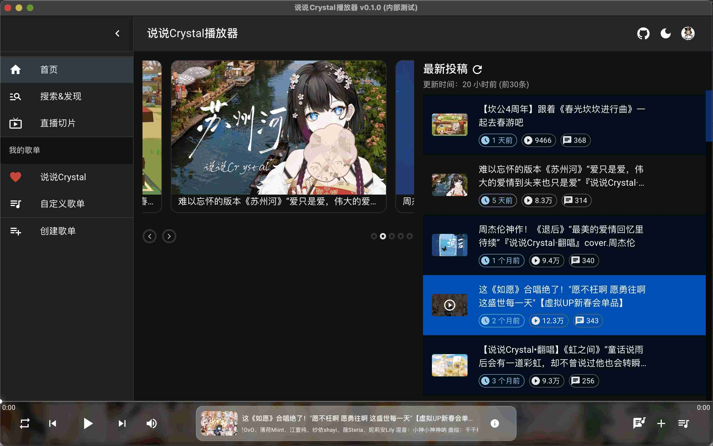
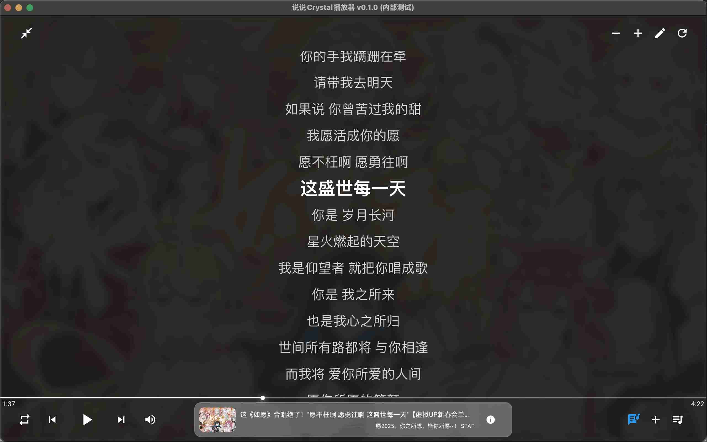

# 说说播放器

“说说播放器”是一款基于Bilibili的第三方音乐播放器。此播放器为粉丝定制版本，可以将说宝或者其他Up主的B站视频投稿变成你的歌单。

"Shuoshuo Player" is a third-party music player based on Bilibili.This player is a customized version for fans, allowing you to turn "说说Crystal" or other Bilibili creators' video submissions into your playlist.




## 特性（Features）
- ✅ 拉取UP主投稿生成歌单
- ✅ 支持将直播切片man的视频列表生成歌单
- ✅ 支持以收藏夹生成成歌单
- ✅ 支持歌词同步显示（支持手动创建）
- ✅ 支持数据导入导出
- ☐ 更多功能请期待

## 隐私安全声明

云服务功能只用于我们提供播放器的一些公共服务（如UP主投稿的自动显示歌词、切片man信息展示）

为了保护用户隐私，**我们不会收集任何个人信息，所有B站登录信息、视频数据均存储在本地。**

播放器的**歌单、播放功能均是模拟用户访问B站**，我们也不会在云端收集任何B站的视频信息。

播放器、云服务端均完全开源免费，仅供学习交流使用，**禁止将播放器用于任何商业用途，否则后果自负。**

## 开发指南

本地环境要求：`nodejs >= 20`，最好安装一下`yarn`

### 1. 克隆目录
```shell
git clone git@github.com:LanceLRQ/shuoshuo-player.git
```

### 2. 安装依赖
```shell
cd shuoshuo-player
yarn                                  # 安装依赖
```
### 3. 启动Web开发环境
```shell
yarn start  # 启动开发环境
# or
yarn start:prod  # 如果你不想部署本地服务端，可以使用线上接口

# 此时访问 http://localhost:3000/player.html 即可看到播放器
```

### 4. 启动Electron环境（建议在步骤3后运行）
```shell
cd ../shuoshuo-player-pc
yarn                # 安装依赖
yarn start          # 启动Electron环境  
```

### 5. 打包
```shell
cd shuoshuo-player-pc
yarn package                       # 构建生产包（和下面的命令二选一即可）
# 或者 yarn make                   
```

## 开发指南 (Chrome插件版本)

### 1、编译代码
```shell
cd shuoshuo-player
yarn build      # 第一次执行的时候要，因为要把manifest.json、background.js复制到chrome插件目录下。以后只要是改播放器，用start命令即可。
yarn start      # 启动开发环境(默认会自动同步文件到build目录下)
```
### 2、在Chrome浏览器插件页面加载`build`目录

### 3、更改Up主

访问`shuoshuo-player/src/constants.js`，修改`MasterUpInfo`变量内的信息

## 云服务端指南

服务端基于Go 1.23版本开发

此云服务端演示了基本的歌词服务、切片man数据管理、账号管理等功能的实现，仅供学习交流使用。

播放器生产环境的云服务功能已转为内部开发，**此仓库内服务端相关代码不再更新**。

```shell
cd env
./dev.sh start
```

### 详细文档请参考：[云服务端开发文档.md](./env/README.md)


## 踩坑：
`react-music-player`自己管理了一套播放列表机制，和本播放器的列表机制冲突了，故最后还是使用howler.js重新实现了一个播放器组件。

## 技术支持
- [howler.js](https://github.com/goldfire/howler.js)
- [ElectronJS](https://www.electronjs.org/)
- [Chrome Extension](https://developer.chrome.com/docs/extensions/) + [React](https://github.com/facebook/react) + [MUI](https://mui.com/zh/)
- [react-chrome-extension-MV3](https://github.com/Sirage-t/react-chrome-extension-MV3)
- 参考：[Azusa-Player](https://github.com/lovegaoshi/NoxPlayer)
- [react-music-player](https://github.com/lijinke666/react-music-player) （虽然把我折腾的死去活来，但还是表达一下感谢陪伴，已经移除了相关模块。）

## 项目协议

本项目基于 [MIT License](https://github.com/LanceLRQ/shuoshuo-player/blob/master/LICENSE) 许可证发行，以下协议是对于 MIT License 的补充，如有冲突，以以下协议为准。

词语约定：本协议中的“本项目”指 `shuoshuo-player` 项目；“使用者”指签署本协议的使用者；“官方音乐平台”指对本项目内置的包括 QQ 音乐，哔哩哔哩动画等音源，歌词来源的官方平台统称；“版权数据”指包括但不限于图像、音频、名字等在内的他人拥有所属版权的数据。

本项目的数据来源原理是从各官方音乐平台的公开服务器中拉取数据，经过对数据简单地筛选与合并后进行展示，因此本项目不对数据的准确性负责。

使用本项目的过程中可能会产生版权数据，对于这些版权数据，本项目不拥有它们的所有权，为了避免造成侵权，使用者务必在24 小时内清除使用本项目的过程中所产生的版权数据。

本项目内的官方音乐平台别名为本项目内对官方音乐平台的一个称呼，不包含恶意，如果官方音乐平台觉得不妥，可联系本项目更改或移除。

本项目内使用的部分包括但不限于字体、图片等资源来源于互联网，如果出现侵权可联系本项目移除。

由于使用本项目产生的包括由于本协议或由于使用或无法使用本项目而引起的任何性质的任何直接、间接、特殊、偶然或结果性损害（包括但不限于因商誉损失、停工、计算机故障或故障引起的损害赔偿，或任何及所有其他商业损害或损失）由使用者负责。

本项目完全免费，且开源发布于 GitHub 面向全世界人用作对技术的学习交流，本项目不对项目内的技术可能存在违反当地法律法规的行为作保证，禁止在违反当地法律法规的情况下使用本项目，对于使用者在明知或不知当地法律法规不允许的情况下使用本项目所造成的任何违法违规行为由使用者承担，本项目不承担由此造成的任何直接、间接、特殊、偶然或结果性责任。

若你使用了本项目，将代表你接受以上协议。

音乐视频平台不易，请尊重版权，支持正版。